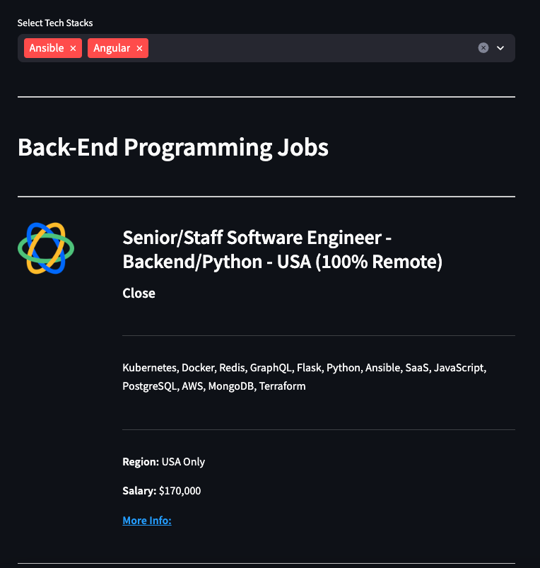

# Job Board Scraping



## Overview

This project is a web scraper built with Python BeautifulSoup, Requests to scrape data and Streamlit for front-end interface that fetches remote job listings from the [We Work Remotely](https://weworkremotely.com) website. It extracts key information such as job title, company name, tech stack, salary, and more, and displays them in a user-friendly interface.

## Demo

You can access the live demo of this project [here](https://tymoteuszmilek-job-board-scraper-srcmain-onsb1o.streamlit.app).

## Features
- Fetches remote job listings from We Work Remotely.
- Displays job details including title, company, tech stack, and salary.
- Allows users to filter jobs based on specific criteria.

## Installation

1. **Clone the repository:**
   ```bash
   git clone https://github.com/tymoteuszmilek/job-board-scraper.git
   cd job-board-scraper/src
   ```
2. **Install the required dependencies:**
     
      ```bash
      pip install -r requirements.txt
      ```
## Usage
1. **Run the program:**
   
      ```bash
      streamlit run main.py
      ```
2. Open your web browser and go to http://localhost:8501 to view the application.
      
3. **Instructions**
   - Upon opening the application in your web browser, you will see an interface with a "Fetch Data" button.
   - Click on the "Fetch Data" button to initiate the scraping process. This will retrieve the latest remote job listings from We Work Remotely.
   - Depending on your internet speed and the number of job listings, it may take a moment to fetch all the data. Please be patient during this process.
   - Once the data is fetched, you will see a list of job listings displayed on the interface.
   - Use the provided filter options (if available) to refine the displayed job listings based on your preferences such as category or tech stack.
   - Click on individual job listings to view detailed information about each job.
